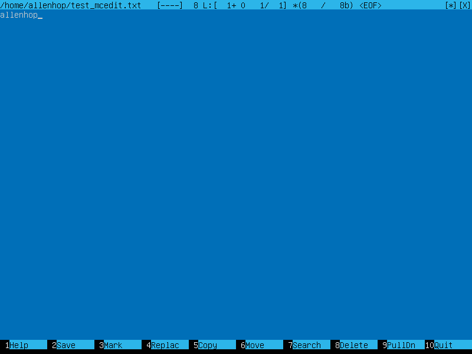
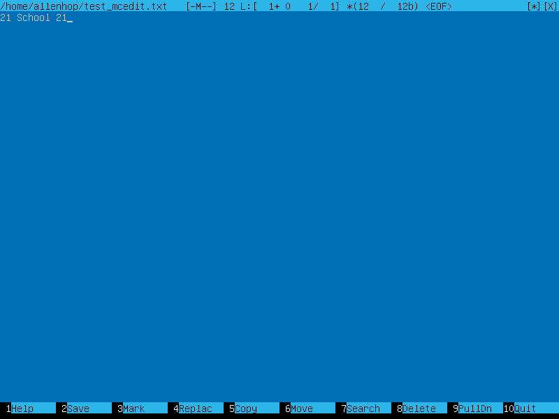
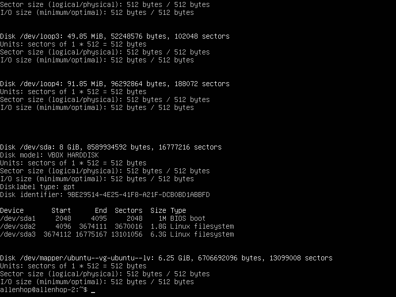

## content

1. [Part 1. Installation of the OS](#part-1)
1. [Part 2. Creating a user](#part-2)
1. [Part 3. Setting up the OS network](#part-3)
1. [Part 4. OS Update](#part-4)
1. [Part 5. Using the sudo command](#part-5)
1. [Part 6. Installing and configuring the time service](#part-6)
1. [Part 7. Installing and using text editors](#part-7)
1. [Part 8. Installing and basic setup of the SSHD service](#part-8)
1. [Part 9. Installing and using the top, htop utilities](#part-9)
1. [Part 10. Using the fdisk utility](#part-10)
1. [Part 11. Using the df utility](#part-11)
1. [Part 12. Using the du utility](#part-12)
1. [Part 13. Installing and using the ncdu utility](#part-13)
1. [Part 14. Working with system logs](#part-14)
1. [Part 15. Using the CRON job scheduler](#part-15)

----

## Part 1
Installation of the OS

----

* Checked system version : `cat /etc/issue`  
	  

----

## Part 2
Creating a user

----

* Ran : `sudo useradd lfs -g adm`  
	  ˚˚
* Then checked passwd file in /etc: `cat /etc/passwd`  
	  

----

## Part 3
Setting up the OS network

----

* In order to set new machine name I ran:
	`sudo hostnamectl set-hostname allenhop-1`  
* In order to set time in the system I used: 
	`sudo timedatectl set-timezone Europe/Moscow`  
* Got names of using network interfaces with:`ip link` and got brief version with option br  
	  
	
>lo is a loopback device. You can imagine it as a virtual network device 		that is on all systems, even if they aren't connected to any network. It has an IP address of 127.0.0.1
and can be used to access network services locally. For example, if you run a web-server on your machine and browse to it with Firefox or Chromium on the same machine, then it will go via this network device.

* Got ip from DHCP server: `dhclient`  

>DHCP - Dynamic Host Configuration Protocol

* Displaied internal ip: `ip route show `and external one: `curl ifconfig.me`  
* In order to set static ip I did next steps  
	* edited /etc/netplan/*.yaml file with vim after edition the file had 		following settings  
	  
	* checked yaml file syntax:`netplan generate`  
	* and applied it: `netplan apply`  
	* rebooted system: `reboot`  
* Checked new settings were applied:`ifconfig`  
* Checked ping:`ping ya.ru -c 5 | ping 1.1.1.1 -c 5`  
	

----

## Part 4
OS Update

----

* Updated system with following steps  
	- first updated apt: `sudo apt update`  
	- then upgraded OS: `sudo apt upgrade`  
* In the end I ran the previous command again in order to check my OS version had the latest update successfully  
  

----

## Part 5
Using the sudo command

----

>sudo means **S**uper **U**ser **DO**. Sudo allows execute commands with super user’s privilage.

* First I gave sudo privilege to *lfs* user: `sudo usermod -a -G sudo lfs` then I set password for lfs user: `passwd lsf` in order to have opportunity to login their account  
* changed user to lfs: `su - lfs`  
* change machine hostname being in lfs users's profile: `hostnaemctl set-hostname allenhop-2`  
* rebooted system  
* finale hostname was allenhop-2  
  

----

## Part 6
Installing and configuring the time service

----

* Current time and time zone: `date +"%Z %T"`  
  
* Show timedatectl settings: `timedatectl show`  
  

----

## Part 7
Installing and using text editors

----

* Installed three apps with `apt install`  
	- Mcedit: `sudo apt-get install mcedit`  
	- Emacs: `sudo apr install e3`  
	- Vim: `apt install vim`  
* Opened mcedit with `mc` and wrote in internal cmdline `touch test_mcedit.txt` to create new file then opened it to edit it with F4  
	* press F2 to save file and F10 to close it  
	  
	* press F10 and choose no to close it without saving  
	  
	* press F7 to make search  
	  
	* press F4 to make replace by search  
	  
* Created new file and opened it in vim with `vim test_vim.txt`  
	* write in vim's cmd `:wq!` to save and close file  
	  
	* write `:q!` and choose no to close it without saving  
	  
	* write `%s/allenhop` to make search  
	  
	* write `%s/allenhop/21 School 21/g` to make replace by search  
	  
* Created new file and opened it in emacs with `vim test_emacs.txt  
	* press ctrl+x ctrl+s to save file and ctrl+x ctrl+c to close it  
	  
	* press ctrl+x ctrl+c and choose no to close it without saving  
	  
	* press ctrl+s to make search  
	  
	* press alt+shift+5 to make replace by search  
	  

----

## Part 8
Installing and basic setup of the SSHD service

----

* Installed sshd service: `sudo apt install openssh-server`
* Added sshd to autorun list: `sudo systemctl enable ssh` or  `systemctl enable sshd`  
* Changed ssh port by following steps  
	1. found file sshd_config placed in /etc/ssh/  
	2. uncommented line with port and wrote port 2202  
	3. restarted sshd servise: `sudo systemctl restart sshd`  
* Used ps with -C option which allows to search processes by their names: `ps -C sshd`.  
Another way to find it is to run ps with -e option which shows all processes in cmdlist then grep the process you need.  
* Rebooted system: `reboot`  
* Ran: `netstat -tan`  
	- t: uses tcp protocol.  
	- a: shows state of all sockets.  
	- n: shows addresses as numbers.  
  
	- Proto: used protocol.  
	- Recv-Q: the count of bytes not copied by the user program connected to this socket.  
	- Send-Q: the count of bytes not acknowledged by the remote host.  
	- Local Address: address of the local socket end.  
	- Foreign Address: address of the remote socket end.  
	- State: state of the socket.  

----

## Part 9
Installing and using the top, htop utilities

----

* Installed top and htop:
	- `apt install top`  
	- `apt install htop`  
* top output  
	- tasks sorted by CPU  
	  
	- tasks sorted by running time  
	  
	1. header's first line shows current time and system uptime, logged users, load averrage per 1/5/15 minutes.  
	2. next lines shows tasks, cpu and memory loading  
	3. you can sort tasks by columns with < and > (my tasks with biggest CPU and time have PIDs 2350 and 2273)  
* htop output  
	- sorted by PID  
	  
	- sorted by CPU  
	  
	- sorted by MEM  
	  
	- sorted by time  
	  
	- filtered sshd  
	  
	- search syslog  
	  
	- changed header  
	  

----

## Part 10
Using the fdisk utility

----

* Ran: `fdisk -l`  
  
	* disk name: VBOX HARDDISK  
	* disk size: 8gb  
	* sectors: 16777216  
	* swap size: 1gb // can check with `free -h`  

----

## Part 11
Using the df utility

----

* Ran: `df \`  
  
	* Partition size: 63232  
	* used: 43348556  
	* available: 167260  
	* used in %: 73  
	* unit: Kb  
* Ran: `df -Th \`  
  
	* Partition size: 6.1Gb
	* used: 4.2Gb
	* available: 1.6Gb 
	* used in %: 73
	* file system type: ext4  

----

## Part 12
Using the du utility

----

* Ran: `du`  
  
* Ran du for /var /home /var/log in machine and human (-h) readable modes. Option -s shows whole size of directory, haven't divided to single files directories.  
  
* Ran: `du -h /var/log/*`  
  

----

## Part 13
Installing and using the ncdu utility

----

* Installed ncdu: `sudo apt install ncdu`  
* ncdu /home  
  
* ncdu /var  
  
* ncdu /var/home  
  

----

## Part 14
Working with system logs

----

* Open for read different logs:   
	* `lnav /var/log/dmesg`  
	* `lnav /var/log/syslog`  
	* `lnav /var/log/auth.log`  
* Last successful login time: `grep -i login /var/log/auth.log`   
  
* Restart sshd service: `sudo systemctl restart sshd`  
  

----

## Part 15
Using the CRON job scheduler

----

* How to add tasks to cron:
	* Opened cronetab file for edition: `cronetab -e`  
	  
	* Added line «*/2 * * * * uptime» to the file and saved it.  
	* Then checked tasks in the list: `«crontab -l»`  
	  
	* Checked syslog: `cat /var/log/syslog`  
	  
	* Cleaned crontab: `crontab -r`. Then checked task list again.  
	  

----