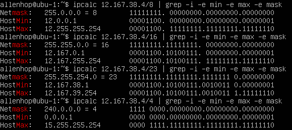
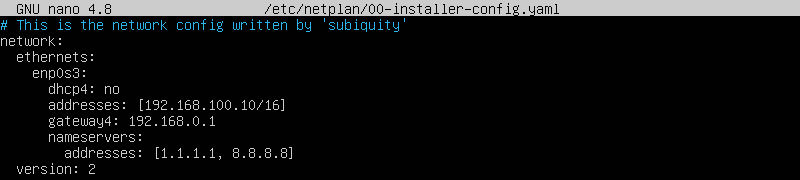
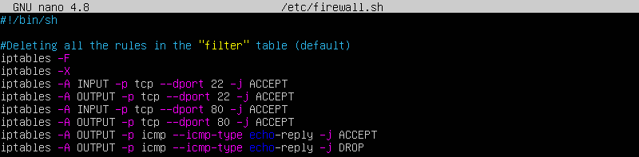
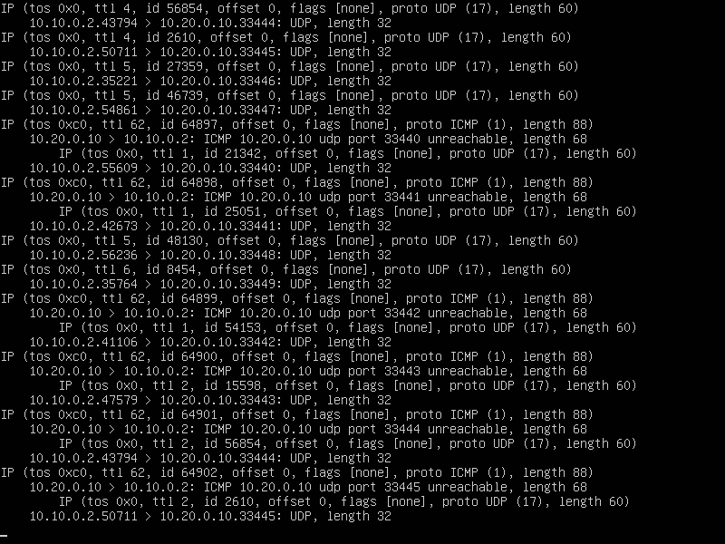
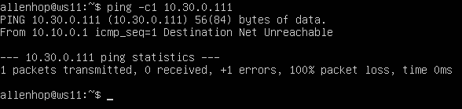
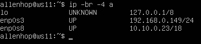
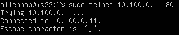

## Contents

1. [Part 1. ipcalc tool](#part-1)
1. [Part 2. Static routing between two machines](#part-2)
1. [Part 3. iperf3 utility](#part-3)
1. [Part 4. Network firewall](#part-4)
1. [Part 5. Static network routing](#part-5)
1. [Part 6. Dynamic IP configuration using DHCP](#part-6)
1. [Part 7. NAT](#part-7)
1. [Part 8. Introduction to SSH Tunnels](#part-8)

----

## Part 1
## ipcalc tool
* **1.** Networks and Masks
    * **1.1.** Network address of 192.167.38.54/13
       
network address is 192.160.0.0
    * **1.2.** Conversion of the mask 255.255.255.0 to prefix and binary,
        

        /15 to normal and binary,
        

        11111111.11111111.11111111.11110000 to normal and prefix: first convert it to prefix, for this you need just to sum amount of ones. Sum is 28 so prefix is 28 too, then run ipcalc to check /28 is right prefix and get normal ip

    * **1.3.** Minimum and maximum host in 12.167.38.4 network with masks: /8, 11111111.11111111.00000000.00000000, 255.255.254.0 and /4

* **2.** localhost

    * can be accessed with
        127.0.0.2
        127.1.0.1
    * can't with
        194.34.23.100
        128.0.0.1

* **3.** Network ranges and segments
    * **3.1.** which of the listed IPs can be used as public and which only as private: 10.0.0.45, 134.43.0.2, 192.168.4.2, 172.20.250.4, 172.0.2.1, 192.172.0.1, 172.68.0.2, 172.16.255.255, 10.10.10.10, 192.169.168.1

        * private:
            10.0.0.45
            192.168.4.2
            172.20.250.4
            172.16.255.255
            10.10.10.10
        * public:
            134.43.0.2
            172.0.2.1
            192.172.0.1
            172.68.0.2
            192.169.168.1
    * **3.2.** which of the listed gateway IP addresses are possible for 10.10.0.0/18 network: 10.0.0.1, 10.10.0.2, 10.10.10.10, 10.10.100.1, 10.10.1.255

        * possible:
            10.10.0.2
            10.10.10.10
            10.10.1.255
        * impossible
            10.0.0.1
            10.10.100.1

----

## Part 2
## Static routing between two machines
* **1.** Start two virtual machines
    * View existing network interfaces with the ip a command

    * Describe the network interface corresponding to the internal network on both machines and set the following addresses and masks: ws1 - 192.168.100.10, mask */16 *, ws2 - 172.24.116.8, mask /12
ubu-1:

ubu-2:

    * Run the netplan apply command to restart the network service

ubu-2:

*  **2.1.** Adding a static route manually
    * Add a static route from one machine to another and back using a `ip r add` command
ubu-1:

ubu-2:

    * Ping the connection between the machines
ubu-1:

ubu-2:

* **2.2.** Adding a static route with saving

    * Restart the machines

    * Add static route from one machine to another using etc/netplan/00-installer-config.yaml file

ubu-2:

    * Ping the connection between the machines

ubu-2:

----

## Part 3
## iperf3 utility
* **3.1.** Connection speed
Convert and write results in the report: 8 Mbps to MB/s, 100 MB/s to Kbps, 1 Gbps to Mbps:
    * 8 Mbps = 1 MB/s,
    * 100 MB/s = 800 000 Kbps
    * 1 Gbps = 1000 Mbps

* **3.2.** iperf3 utility
Measure connection speed between ws1 and ws2
    Add a screenshots with the call and output of the used commands to the report.
    * first start the server on the one server with `iperf3 -s`
    
    * then send request from another server to the server with `iperf3 -c 172.24.116.8 -R`
    

----

## Part 4
## Network firewall
* **4.1.** iptables utility
    * /etc/firewall.sh for the first machine
    
    * then run this file with:
    
    * /etc/firewall.sh for the second machine
    
    * then run this file too with:
    

    > The diffrnce between /etc/firewall.sh files used in the firsts and the second machine: only the first suitable rule is going to be executed, other similar rules that are applied ignored

    * ping and nmap the first machine from the second one
    
    * on other hand ubu-2 can be found when we ping from ubu-1
    

----

## Part 5
## Static network routing
* **5.1.** Configuration of machine addresses
    * etc/netplan/00-installer-config.yaml for:
        * r1
    
        * r2
    
        * w11
    
        * w21
    
        * w22
    
    * Restart the network service and check ip with `ip -4 a` for:
        * r1
    
        * r2
    
        * ws11
    
        * ws21
    
        * ws22
    
    * ping machines in internal net:
        * ws11 from r1
    
        * ws22 from ws21
    

* **5.2.** Enabling IP forwarding
    * run `sysctl -w net.ipv4.ip_forward=1` on
        * r1
    
        * r2
    

* edit /etc/sysctl.conf file on
        * r1
    
        * r2
    

* **5.3.** Default route configuration
    * Configure the default route (gateway) for the workstations
        * ws11
    
        * ws21
    
        * ws22
    

    * Call ip r and show that a route is added to the routing table
        * ws11
    
        * ws21
    
        * ws22
    
    * Ping r2 router from ws11 and show on r2 that the ping is reaching. To do this, use the tcpdump -tn -i eth1
        * call tcpdump in r1 then ping r1 from ws11
        * ping command output
     
        * tcpdump output
     

* **5.4.** Adding static routes
    * Add static routes to r1 and r2 in configuration file
        * configuration file for r1
        
        * configuration file for r2
        
    * Call ip r and show route tables on both routers
        * r1
        
        * r2
        
    * Run ip r list 10.10.0.0/[netmask] and ip r list 0.0.0.0/0 commands on ws11
    

    > 10.10.0.0/18 is the same net segment so other IPs in the segment don't need gateway to access it, on other hand 0.0.0.0/0 what means 'default way' to exteranl net and it needs be used via gateway.

* **5.5.** Making a router list
    * Run the tcpdump -tnv -i eth0 dump command on r1
    
    * Use traceroute utility to list routers in the path from ws11 to ws21
    
    * tcpdump output
    

    > Traceoute sends packets to the nearest node which paths to the destination host and get reply form it. Then it sends packets to the next node situated after the nearest node and expects reply from it and so on. It sends packets while it recieve them back and until it reaches the destination node or doesn's recieve reply from any node three times.

* **5.6.** Using ICMP protocol in routing
    * Run on r1 network traffic capture going through eth0 with the tcpdump -n -i enp0s8 icmp command.
    
    * Ping a non-existent IP
    
    * tcpdump output
    

----

## Part 6
## Dynamic IP configuration using DHCP
* **6.1.** Dynamic IP
    * specify the default router address, DNS-server and internal network address in /etc/dhcp/dhcpd.confg
    
    * Write nameserver 8.8.8.8. in a resolv.conf file
    
    * Restart the DHCP service with systemctl restart isc-dhcp-server
    
    * Set netplan configuration to dhcp4: true
    
    * Reboot the ws21 machine with reboot and show with ip a that it has got an address
    
    * Ping ws22 from ws21
    
    * Specify MAC address at ws11 by adding to etc/netplan/00-installer-config.yaml
    
    * Сonfigure r1 the same way as r2, but make the assignment of addresses strictly linked to the MAC-address (ws11)
    
    * restart DHCP server and check its status
    
    * reboot ws11 and check its IP
    
    * ping all machines in the local net
    
    * Request ip address update from ws21
    

    > `sudo dhclient -r` to release all ports from their IP. You can release specific port via adding its name to the command. Then call `sudo dhclient` to get new IP.

----

## Part 7
## NAT
* In /etc/apache2/ports.conf file change the line Listen 80 to Listen 0.0.0.0:80on ws22 and r1
    * ws22
    
    * r1
    

* Start the Apache web server with service apache2 start command on ws22 and r1
    * ws22
    
    * r1
    
* Firewall:
    * Add the following rules to the firewall
    
    * then run firewall
    
    * ping ws22 from r1, all packets lossed
    
    * but there is connection
    
    * Allow routing of all ICMP protocol packets
    
    * then restart firewall
    
    * ping ws22 from r1, pingable!
    
    * Add two more rules to the file: Enable SNAT, which is masquerade all local ip from the local network behind r2 and Enable DNAT on port 8080 of r2 machine and add external network access to the Apache web server running on ws22
    
    * restart firewall
    
    * Check the TCP connection for SNAT by connecting from ws22 to the Apache server
    
    * Check the TCP connection for DNAT by connecting from r1 to the Apache server on ws22 with the telnet command (address r2 and port 8080)
    

-----

## Part 8
## Introduction to SSH Tunnels
* Run a firewall on r2 with the rules from Part 7
    * check rules
    
    * and apply them
    

* Start the Apapche web server on ws22 on localhost only (i.e. in /etc/apache2/ports.conf file change the line Listen 80 to Listen localhost:80)
    * change listen port
    
    * and satrt apache server
    

* Use Local TCP forwarding from ws21 to ws22 to access the web server on ws22 from ws21
    * run
    
    * and check connection
    

* Use Remote TCP forwarding from ws11 to ws22 to access the web server on ws22 from ws11
    * run
    
    * and check connection
    

----