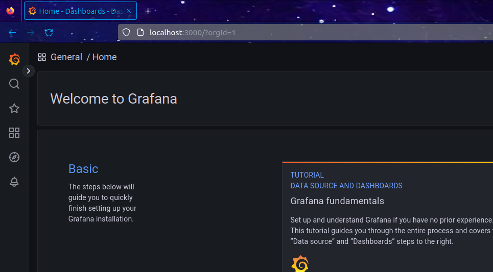

## Part 7. Prometheus и Grafana

Сначала запускаем скрипт для установки Prometheus и Grafana\
Пробрасываем порты на виртуальной машине\

- Запускаем веб интерфейс Prometheus
    

- то же самое для Grafana
    

- Дашборды готовы и установлены
    

- Запускаем скрипт из второго задания и проверяем количество памяти на дашборде
    

- Запускаем `stress -c 2 -i 1 -m 1 --vm-bytes 32M -t 60s` и проверяем нагрузку CPU
    

