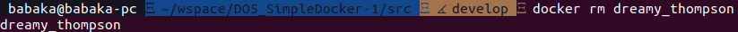

## Part 1. Ready-made docker

1. `docker pull` and `docker images` outputs\

1. `docker run -d nginx` output\

1. `docker ps`\

1. `docker inspect` oputput\

1. find size, ip and exposed ports in `docker inspect` output with `grep`\

1. stop the container with `docker stop` and check the container was stoped with `docker ps`\

1. start the container with the mapped ports with flag `-p`

1. check the port 80\

1. restart the docker with `docker restart` and check it was restarted with `docker ps`

## Part 2.

1. Read the nginx.conf configuration file inside the docker container with the exec command\

1. Create a nginx.conf file on a local machine\

1. Configure it on the /status path to return the nginx server status page\

1. Copy the created nginx.conf file inside the docker image using the docker cp command\

1. Restart nginx inside the docker image with exec\

1. Check that localhost:80/status returns the nginx server status page\

1. Export the container to a container.tar file with the export command\

1. Stop the container

1. Delete the image with docker rmi [image_id|repository]without removing the container irst\

1.  Delete stopped container\

1. Import the container back using the importcommand\

1. Run the imported container\

1. Check that localhost:80/status returns the nginx server status page\

## Part 3.

1. index.c file which prints Hello World!\

1. nginx.conf file\

In order to run this file and to see 'Hello World!':
1. run container `docker run -d -p 81:81 --name my_container`
3. copy index.c and nginx.c conf `docker cp ./index.c my_container:etc/nginx/` `docker cp ./nginx.conf my_container:/etc/nginx/`
4. enter iside into the containet and execute next commands inside it
5. install gcc spawn-fcgi libfcgi-dev in the container `apt update` `apt install gcc spawn-fcgi libfcgi-dev`
6. `docker exec my_container gcc /etc/nginx/index.c -lfcgi`
7. `spawn-fcgi -p 8080 a.out`
8. `docker exec my_container nginx -s reload`
9. `curl localhost:81`
1. out put of `localhost:80`\

## Part 4.

run the following:

1. `docker build -t my_name:mytag .`
2. `docker run -dp 80:81 my_name:mytag`
3. `curl localhost:80`
3. `curl localhost/status`

Result in the browser:\
`localhost:80`\
\
and `localhost/status`\
\

## Part 5.

run `hz.sh` from part-5 folder \

## Part 6.

1. run `docker compose build`\

1. run `docker compose up`\

1. run `curl localhost:80`\

1. check browser \

